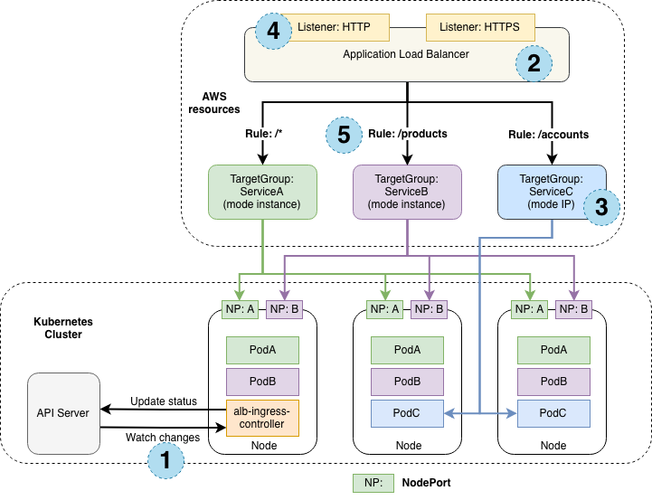

```ad-attention
title: This is a github note

```

# aws-load-balancer-controller
## github
- https://github.com/kubernetes-sigs/aws-load-balancer-controller
- https://kubernetes-sigs.github.io/aws-load-balancer-controller/v2.4/how-it-works/



## workshop
- [[awslbc-ingress-lab-echoserver#install-echoserver-📚]]
- https://www.eksworkshop.com/beginner/180_fargate/prerequisites-for-alb/
- 常用ingress的相关配置 ([[awslbc-ingress-settings]])
- 使用已有ingress的相关配置 ([[awslbc-ingress-settings-ingress-group]])
- pod rediness gate ([link](https://kubernetes-sigs.github.io/aws-load-balancer-controller/v2.4/deploy/pod_readiness_gate/))

## install
- [refer](https://kubernetes-sigs.github.io/aws-load-balancer-controller/v2.4/deploy/installation/) 

{}
this note covered by flux-lab
{}

```sh
CLUSTER_NAME=ekscluster1
export AWS_DEFAULT_REGION=us-east-2
eksctl utils associate-iam-oidc-provider \
  --cluster ${CLUSTER_NAME} \
  --approve

#curl -o iam_policy.json https://raw.githubusercontent.com/kubernetes-sigs/aws-load-balancer-controller/v2.4.1/docs/install/iam_policy.json
git clone https://github.com/kubernetes-sigs/aws-load-balancer-controller.git

# aws commercial region
IAM_POLICY_TEMPLATE=iam_policy.json 
# aws china region
# IAM_POLICY_TEMPLATE=iam_policy_cn.json 
cp aws-load-balancer-controller/docs/install/${IAM_POLICY_TEMPLATE} .

policy_name=AWSLoadBalancerControllerIAMPolicy-`date +%m%d%H%M`
policy_arn=$(aws iam create-policy \
  --policy-name ${policy_name}  \
  --policy-document file://${IAM_POLICY_TEMPLATE} \
  --query 'Policy.Arn' \
  --output text)

eksctl create iamserviceaccount \
  --cluster=${CLUSTER_NAME} \
  --namespace=kube-system \
  --name=aws-load-balancer-controller \
  --role-name=${policy_name} \
  --attach-policy-arn=${policy_arn} \
  --override-existing-serviceaccounts \
  --approve

helm repo add eks https://aws.github.io/eks-charts
helm repo update

# following helm cmd will fail if you use 3.9.0 version
# downgrade to helm 3.8.2
# and another solved issue is here: [[ingress-controller-lab-issue]]
helm install aws-load-balancer-controller eks/aws-load-balancer-controller \
  -n kube-system \
  --set clusterName=${CLUSTER_NAME} \
  --set serviceAccount.create=false \
  --set serviceAccount.name=aws-load-balancer-controller 

kubectl get deployment -n kube-system aws-load-balancer-controller

```

[[awslbc-ingress-controller-lab-issue]]

### in china region
```sh
# using china region ecr url
helm upgrade -i aws-load-balancer-controller \
    eks/aws-load-balancer-controller \
    -n kube-system \
    --set clusterName=${CLUSTER_NAME} \
    --set serviceAccount.create=false \
    --set serviceAccount.name=aws-load-balancer-controller \
    --set image.repository=961992271922.dkr.ecr.cn-northwest-1.amazonaws.com.cn/amazon/aws-load-balancer-controller \
    # --set region=${AWS_DEFAULT_REGION} \
    # --set vpcId=${VPC_ID} 

```

find registry url from [[eks-container-image-registries-url-by-region]]
using parameter `image.repository`  (refer [LINK](https://github.com/kubernetes-sigs/aws-load-balancer-controller/tree/main/helm/aws-load-balancer-controller))

if you got `ImagePullBackOff`, could replace domain name as following
```sh
kubectl -n kube-system edit deployment aws-load-balancer-controller

```

```
# https://docs.aws.amazon.com/eks/latest/userguide/add-ons-images.html
# add `.cn` postfix for china region
REGISTRY=602401143452.dkr.ecr.us-east-1.amazonaws.com
# REGISTRY=961992271922.dkr.ecr.cn-northwest-1.amazonaws.com.cn

```


## blog
- [[How To Expose Multiple Applications on Amazon EKS Using a Single Application Load Balancer]]
- [[Expose Amazon EKS pods through cross-account load balancer]]


## slide
![[aws-load-balancer-controller-png-2.png]]


