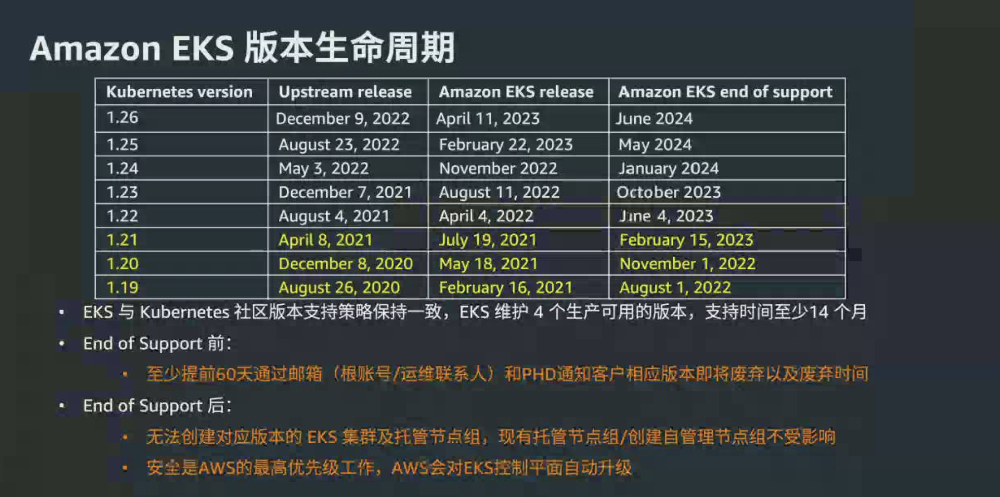
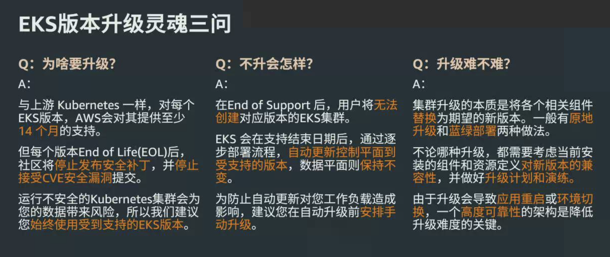

```ad-attention
title: This is a github note

```

# eks-upgrade-procedure

- [workshop](#workshop)
- [流程](#%E6%B5%81%E7%A8%8B)
- [deck](#deck)
- [refer](#refer)
	- [参考文档](#%E5%8F%82%E8%80%83%E6%96%87%E6%A1%A3)


## workshop

- [中文升级 workshop](https://catalog.us-east-1.prod.workshops.aws/workshops/2b3af041-8716-4fde-ab3b-408a1036ec7d/zh-CN/30-worker-nodes-upgrade/33-create-new-node-group)
- [[eks-upgrade-lab]]
	- https://eks-upgrades-workshop.netlify.app/
- [Workshop](https://www.eksworkshop.com/intermediate/320_eks_upgrades/) 
- [Accelerate software development lifecycles with GitOps](https://catalog.us-east-1.prod.workshops.aws/workshops/20f7b273-ed55-411f-8c9c-4dc9e5ff8677/en-US)


## 流程 

1: 检查应用配置文件兼容性
- kube-no-trouble ([link](kube-no-trouble.md) or [hugo](kube-no-trouble))
- pluto ([link](pluto.md) or [hugo](pluto))
- eksup ([link](eksup.md) or [hugo](eksup))
- 检查第三方插件 ([link](eks-addons-list.md) or  [hugo]()) 

2: 升级核心addon （如果目标版本和 addon 有兼容问题则先升级，否则在升级完管理节点后升级）
- coredns: 
	- 托管dns addon ([[managed-coredns]])
	- 自管dns addon ([[self-managed-coredns]])
- aws-node: [[upgrade-vpc-cni]] 
- kube-proxy: [[eks-addons-kube-proxy]]

3: 升级eks控制平面

4: 升级eks管理节点
- 托管节点的更新 [LINK](https://docs.aws.amazon.com/zh_cn/eks/latest/userguide/update-managed-node-group.html) 
	- [[ssm-document-eks-node-upgrade]] 
- 自管节点的更新 [LINK](https://docs.aws.amazon.com/zh_cn/eks/latest/userguide/update-workers.html) 


## others
- [[mm-eks-upgrade-workshop-walkley]]

## deck





## refer
- [Amazon EKS 集群升级指南](https://aws.amazon.com/cn/blogs/china/amazon-eks-cluster-upgrade-guide/) 
- [amazon-eks-版本管理策略与升级流程](https://aws.amazon.com/cn/blogs/china/amazon-eks-version-management-strategy-and-upgrade-process/) 
- [Automate Amazon EKS upgrades with infrastructure as code](https://aws.amazon.com/blogs/opensource/automate-amazon-eks-upgrades-with-infrastructure-as-code/) 
- [[GCR Resilience Series - EKS Resilience]]
- https://kubernetes.io/releases/version-skew-policy/


### 参考文档
-   Kubernetes官方文档: [Kubernetes Release Cycle](https://github.com/kubernetes/community/blob/master/contributors/devel/sig-release/release.md)
-   Kubernetes官方文档: [Kubernetes Deprecation Policy](https://kubernetes.io/docs/reference/using-api/deprecation-policy/)
-   Kubernetes博客: [Increasing the Kubernetes Support Window to One Year](https://kubernetes.io/blog/2020/08/31/kubernetes-1-19-feature-one-year-support/)
-   AWS博客: [Planning Kubernetes Upgrades with Amazon EKS](https://aws.amazon.com/blogs/containers/planning-kubernetes-upgrades-with-amazon-eks/)
-   AWS博客: [Making Cluster Updates Easy with Amazon EKS](https://aws.amazon.com/blogs/compute/making-cluster-updates-easy-with-amazon-eks/)
-   AWS官方文档: [Amazon EKS Kubernetes versions](https://docs.aws.amazon.com/eks/latest/userguide/kubernetes-versions.html)
-   AWS官方文档: [Updating a cluster](https://docs.aws.amazon.com/eks/latest/userguide/update-cluster.html)
-   EKS最佳实践手册: [Handling Cluster Upgrades](https://aws.github.io/aws-eks-best-practices/reliability/docs/controlplane/#handling-cluster-upgrades)


