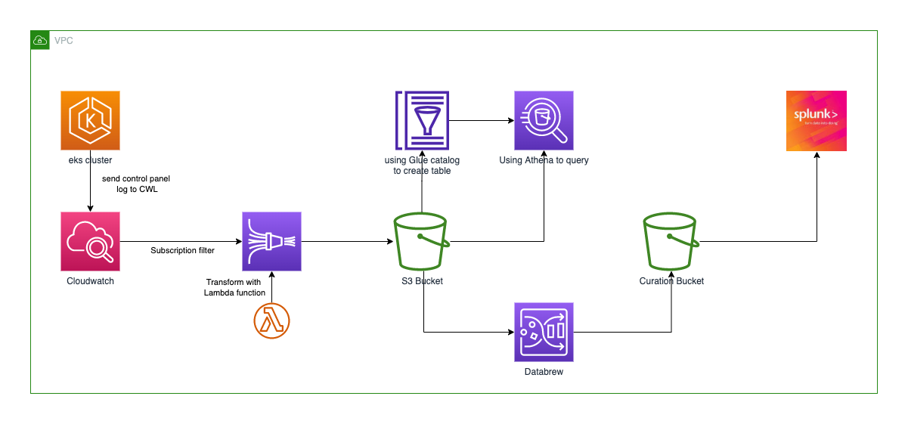
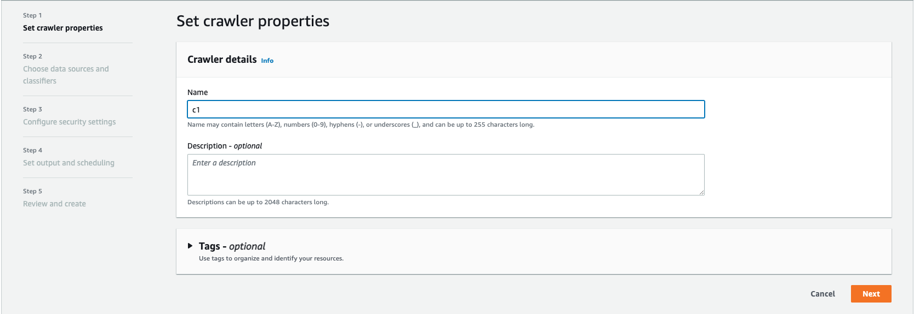
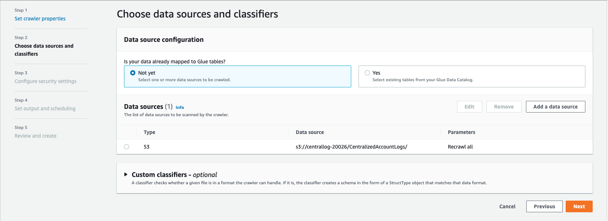
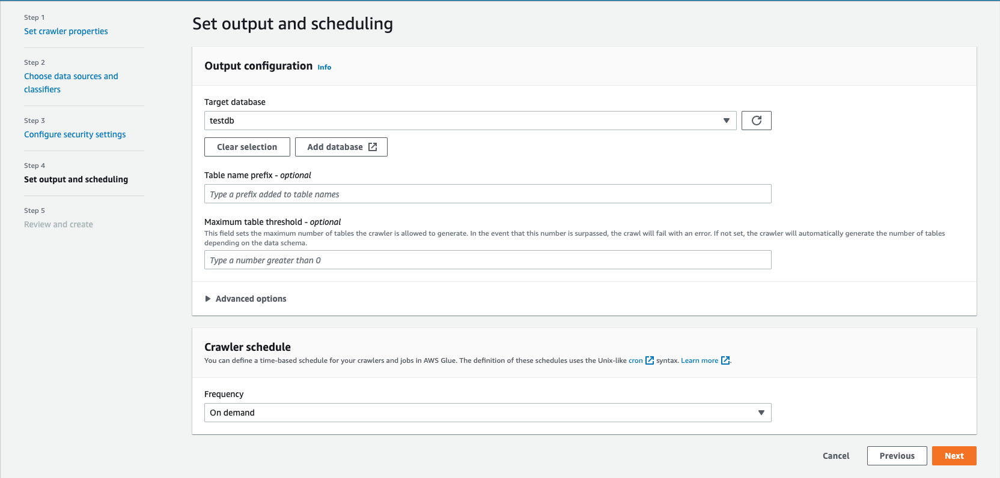
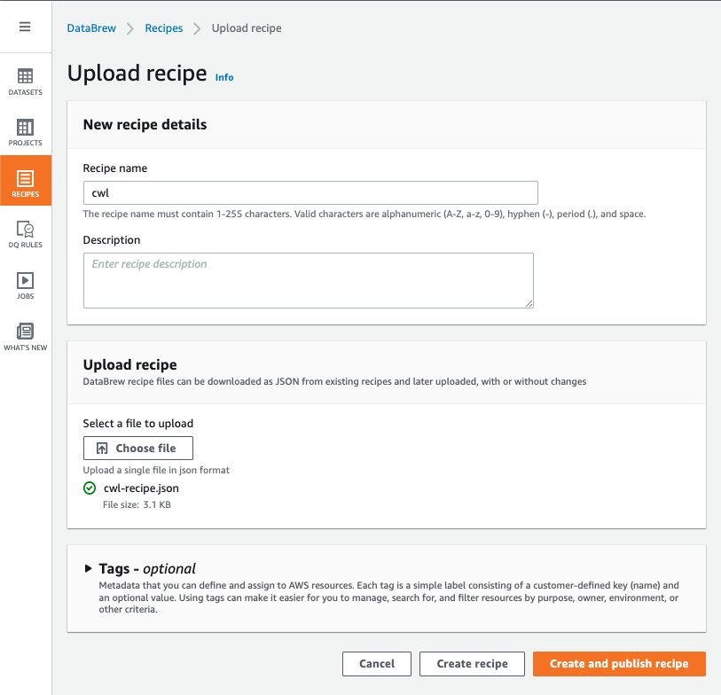
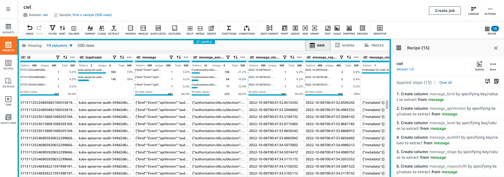
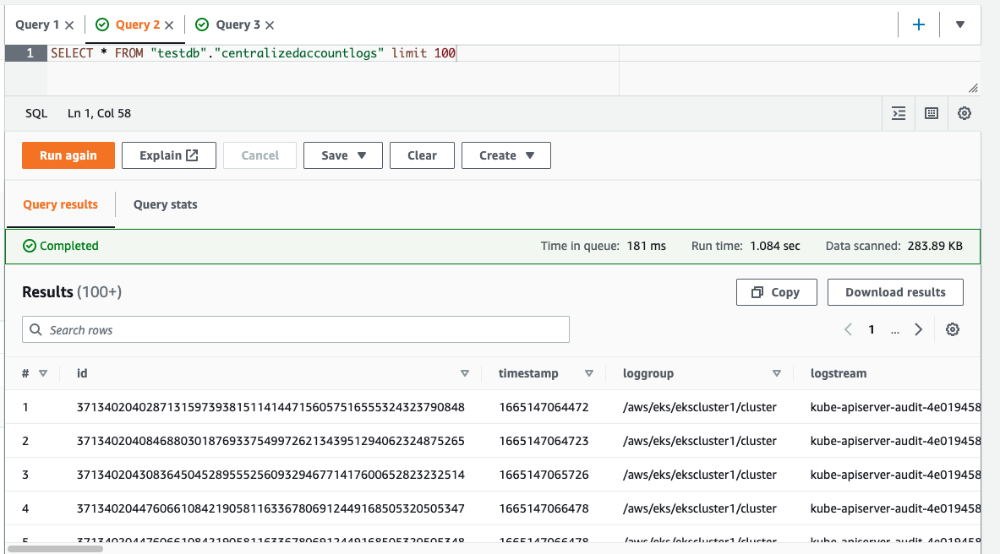
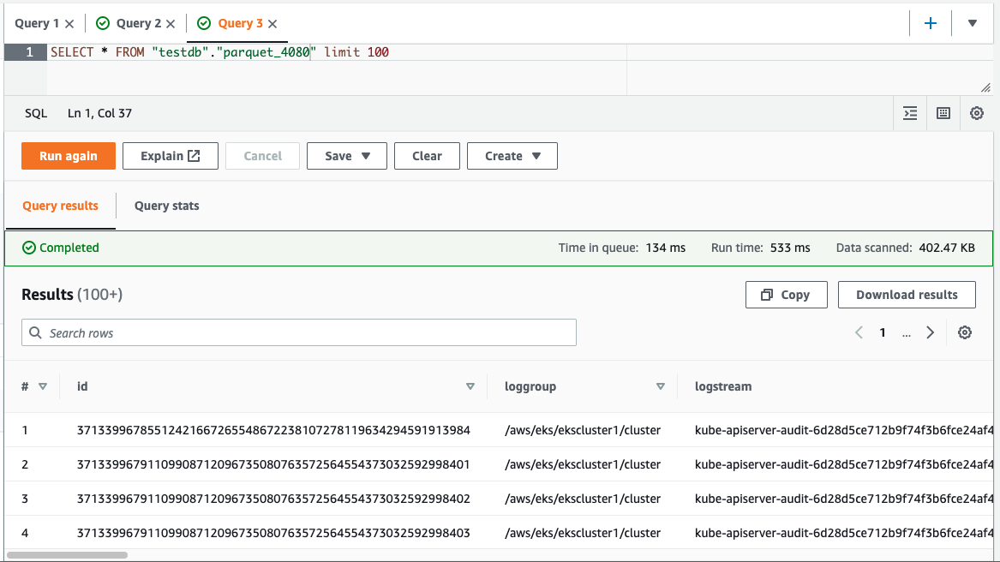

> [!WARNING] This is a github note

# stream-k8s-control-panel-logs-to-s3

## background

目前 eks 控制平面日志只支持发送到 cloudwatch，且在同一个 log group 中有 5 种类型 6种前缀的 log stream 的日志，不利于统一查询。且只有 audit 日志是 json 格式其他均是单行日志，且字段各不相同。

- kube-apiserver-audit
- kube-apiserver
- kube-scheduler
- authenticator
- kube-controller-manager
- cloud-controller-manager

## requirement

客户需求：
1. 简单 - 已有 splunk 日志平台，不希望使用 opensearch 等其他日志平台，保证运维简化
2. 实时 - 需要有方法将日志近实时地发送到S3，可以通过 splunk 进行查询和实时告警。export cloudwatch 日志的方式，实时性无法满足，且同样需要额外实现 export 端点续导的问题
3. 二次处理 - 未来可以实现对日志进行查询及关键字段提取方便进行分析和告警
4. 成本和安全 - 成本控制，高安全性，支持多账号

## architecture



## 搭建实验环境

### eks cluster

- need an EKS cluster and enable log to cloudwatch

### s3
- 创建s3桶

```sh
export AWS_PAGER=""
export AWS_REGION=$(curl -s 169.254.169.254/latest/dynamic/instance-identity/document | jq -r '.region')
export AWS_DEFAULT_REGION=${AWS_REGION}
export AWS_ACCOUNT_ID=$(aws sts get-caller-identity \
--query "Account" --output text)

UNIQ=$(date +%Y%m%d%H%M)
BUCKET_NAME=centrallog-$UNIQ
S3_PREFIX="CentralizedAccountLogs"
aws s3 mb s3://${BUCKET_NAME}

ATHENA_BUCKET_NAME=athena-$UNIQ
aws s3 mb s3://${ATHENA_BUCKET_NAME}

```

### lambda
- 创建函数所需角色
- 下载定制 lambda 代码 和 layer （参见cloudwatch-to-firehose-python ([link](cloudwatch-to-firehose-python.md) or [hugo](cloudwatch-to-firehose-python.md))）
    - [lambda_function.py](lambda_function.py)
    - [package.zip](package.zip)
- 创建函数并获取arn

```sh
echo ${AWS_REGION} ${UNIQ}
LAMBDA_NAME=firehose-lambda-${UNIQ}

if [[ ${AWS_REGION%%-*} == "cn" ]]; then
  ARN_PREFIX="aws-cn"
else
  ARN_PREFIX="aws"
fi

# create lambda role
LAMBDA_ROLE_NAME=${LAMBDA_NAME}-role-${UNIQ}
echo '{"Version": "2012-10-17","Statement": [{ "Effect": "Allow", "Principal": {"Service": "lambda.amazonaws.com"}, "Action": "sts:AssumeRole"}]}' |tee lambda-role-trust-policy.json
aws iam create-role --role-name ${LAMBDA_ROLE_NAME} --assume-role-policy-document file://lambda-role-trust-policy.json

envsubst >lambda-role-policy.json <<-EOF
{
    "Version": "2012-10-17",
    "Statement": [
        {
            "Action": [
                "firehose:PutRecord",
                "firehose:PutRecordBatch"
            ],
            "Effect": "Allow",
            "Resource": "arn:${ARN_PREFIX}:firehose:${AWS_REGION}:${AWS_ACCOUNT_ID}:deliverystream/*"
        }
    ]
}
EOF

LAMBDA_POLICY_ARN=$(aws iam create-policy \
--policy-name ${LAMBDA_ROLE_NAME} \
--policy-document file://lambda-role-policy.json |jq -r '.Policy.Arn')

aws iam attach-role-policy --role-name ${LAMBDA_ROLE_NAME} --policy-arn ${LAMBDA_POLICY_ARN}
aws iam attach-role-policy --role-name ${LAMBDA_ROLE_NAME} --policy-arn arn:${ARN_PREFIX}:iam::aws:policy/service-role/AWSLambdaBasicExecutionRole
aws iam attach-role-policy --role-name ${LAMBDA_ROLE_NAME} --policy-arn arn:${ARN_PREFIX}:iam::aws:policy/service-role/AWSLambdaKinesisExecutionRole
LAMBDA_ROLE_ARN=$(aws iam get-role --role-name ${LAMBDA_ROLE_NAME} |jq -r '.Role.Arn')

# download code and create lambda
# wget -O lambda_function.py https://github.com/panlm/aws-labs/raw/main/eks-cloudwatch-log-firehose-s3/lambda_function.py
zip lambda_function.zip ./lambda_function.py

sleep 10
aws lambda create-function \
	--function-name ${LAMBDA_NAME} \
	--runtime python3.8 \
	--timeout 60 \
	--zip-file fileb://lambda_function.zip \
	--handler lambda_function.lambda_handler \
	--role ${LAMBDA_ROLE_ARN}

LAMBDA_ARN=$(aws lambda get-function \
	--function-name ${LAMBDA_NAME} \
	--query 'Configuration.FunctionArn' --output text)

# download package and create lambda layer
# wget -O package.zip https://github.com/panlm/aws-labs/raw/main/eks-cloudwatch-log-firehose-s3/package.zip

aws lambda publish-layer-version \
	--layer-name layer_flatten_json \
	--description "flatten_json" \
	--zip-file fileb://package.zip \
	--compatible-runtimes python3.8
LAYER_ARN=$(aws lambda list-layer-versions \
	--layer-name layer_flatten_json \
	--query 'LayerVersions[0].LayerVersionArn' --output text)

# add layer to lambda
aws lambda update-function-configuration --function-name ${LAMBDA_NAME} \
--layers ${LAYER_ARN}

```

### firehose
- 创建firehose所需角色
- 创建firehose并且关联 transform 函数
- 获取arn

```sh
FIREHOSE_NAME=firehose-${UNIQ}
FIREHOSE_ROLE_NAME=${FIREHOSE_NAME}-role-${UNIQ}
echo "LAMBDA_NAME:"${LAMBDA_NAME} "LAMBDA_ARN:"${LAMBDA_ARN} "AWS_REGION:"${AWS_REGION} "ARN_PREFIX:"${ARN_PREFIX} "AWS_ACCOUNT_ID:"${AWS_ACCOUNT_ID} "BUCKET_NAME:"${BUCKET_NAME} "S3_PREFIX:"${S3_PREFIX}

echo '{
    "Version": "2012-10-17",
    "Statement": [
        {
            "Effect": "Allow",
            "Principal": {
                "Service": "firehose.amazonaws.com"
            },
            "Action": "sts:AssumeRole"
        }
    ]
}' |tee firehose-role-trust-policy.json
aws iam create-role --role-name ${FIREHOSE_ROLE_NAME} \
  --assume-role-policy-document file://firehose-role-trust-policy.json

envsubst >firehose-role-policy.json <<-EOF
{
    "Version": "2012-10-17",
    "Statement": [
        {
            "Sid": "",
            "Effect": "Allow",
            "Action": [
                "s3:AbortMultipartUpload",
                "s3:GetBucketLocation",
                "s3:GetObject",
                "s3:ListBucket",
                "s3:ListBucketMultipartUploads",
                "s3:PutObject"
            ],
            "Resource": [
                "arn:${ARN_PREFIX}:s3:::${BUCKET_NAME}",
                "arn:${ARN_PREFIX}:s3:::${BUCKET_NAME}/*"
            ]
        },
        {
            "Sid": "",
            "Effect": "Allow",
            "Action": [
                "lambda:InvokeFunction",
                "lambda:GetFunctionConfiguration"
            ],
            "Resource": "arn:${ARN_PREFIX}:lambda:${AWS_REGION}:${AWS_ACCOUNT_ID}:function:%FIREHOSE_POLICY_TEMPLATE_PLACEHOLDER%"
        },
        {
            "Sid": "",
            "Effect": "Allow",
            "Action": [
                "logs:PutLogEvents"
            ],
            "Resource": [
                "arn:${ARN_PREFIX}:logs:${AWS_REGION}:${AWS_ACCOUNT_ID}:log-group:/aws/kinesisfirehose/${FIREHOSE_NAME}:log-stream:*",
                "arn:${ARN_PREFIX}:logs:${AWS_REGION}:${AWS_ACCOUNT_ID}:log-group:%FIREHOSE_POLICY_TEMPLATE_PLACEHOLDER%:log-stream:*"
            ]
        }
    ]
}
EOF

sed -i '/:function:/s/%FIREHOSE_POLICY_TEMPLATE_PLACEHOLDER%/'"${LAMBDA_NAME}"':$LATEST/' firehose-role-policy.json

FIREHOSE_POLICY_ARN=$(aws iam create-policy \
--policy-name ${FIREHOSE_ROLE_NAME} \
--policy-document file://firehose-role-policy.json |jq -r '.Policy.Arn')

aws iam attach-role-policy \
--role-name ${FIREHOSE_ROLE_NAME} \
--policy-arn ${FIREHOSE_POLICY_ARN}
aws iam list-attached-role-policies --role-name ${FIREHOSE_ROLE_NAME}

FIREHOSE_ROLE_ARN=$(aws iam get-role --role-name ${FIREHOSE_ROLE_NAME} |jq -r '.Role.Arn')

sleep 10
aws firehose create-delivery-stream \
--delivery-stream-name ${FIREHOSE_NAME} \
--delivery-stream-type "DirectPut" \
--extended-s3-destination-configuration "RoleARN=${FIREHOSE_ROLE_ARN},BucketARN=arn:aws:s3:::${BUCKET_NAME},Prefix=${S3_PREFIX}/,ErrorOutputPrefix=${S3_PREFIX}_failed/,BufferingHints={SizeInMBs=2,IntervalInSeconds=120},CompressionFormat=GZIP,EncryptionConfiguration={NoEncryptionConfig=NoEncryption},CloudWatchLoggingOptions={Enabled=true,LogGroupName=${FIREHOSE_ROLE_NAME},LogStreamName=${FIREHOSE_ROLE_NAME}},ProcessingConfiguration={Enabled=true,Processors=[{Type=Lambda,Parameters=[{ParameterName=LambdaArn,ParameterValue=${LAMBDA_ARN}:\$LATEST},{ParameterName=BufferSizeInMBs,ParameterValue=1},{ParameterName=BufferIntervalInSeconds,ParameterValue=60}]}]}"

# no lambda for data transform
# --s3-destination-configuration "RoleARN=${role_arn},BucketARN=arn:aws:s3:::${bucket_name},Prefix=CentralizedAccountLogs/,ErrorOutputPrefix=CentralizedAccountLogs_failed/,BufferingHints={SizeInMBs=1,IntervalInSeconds=60},CompressionFormat=UNCOMPRESSED,EncryptionConfiguration={NoEncryptionConfig=NoEncryption},CloudWatchLoggingOptions={Enabled=true,LogGroupName=${role_name},LogStreamName=${role_name}}"

FIREHOSE_ARN=$(aws firehose describe-delivery-stream \
--delivery-stream-name ${FIREHOSE_NAME} \
--query "DeliveryStreamDescription.DeliveryStreamARN" --output text)

while true ; do
  FIREHOSE_STATUS=$(aws firehose describe-delivery-stream --delivery-stream-name ${FIREHOSE_NAME} --query "DeliveryStreamDescription.DeliveryStreamStatus" --output text)
  echo ${FIREHOSE_STATUS}
  if [[ ${FIREHOSE_STATUS} == "ACTIVE" ]]; then
    break
  fi
  sleep 10
done

```


### cloudwatch
- 创建cwl所需角色来访问firehose

```sh
CWL_ROLE_NAME=cwl-firehose-role-$UNIQ
echo "AWS_REGION:"${AWS_REGION} "AWS_ACCOUNT_ID:"${AWS_ACCOUNT_ID} "ARN_PREFIX:"${ARN_PREFIX}

if [[ ${AWS_REGION%%-*} == "cn" ]]; then
  DN_SUFFIX="com.cn"
else
  DN_SUFFIX="com"
fi

envsubst > cwl-role-trust-policy.json <<-EOF
{
  "Version": "2012-10-17",
  "Statement": [
    {
      "Effect": "Allow",
      "Principal": {
        "Service": "logs.${AWS_REGION}.amazonaws.${DN_SUFFIX}"
      },
      "Action": "sts:AssumeRole"
    }
  ]
}
EOF
aws iam create-role --role-name ${CWL_ROLE_NAME} \
  --assume-role-policy-document file://cwl-role-trust-policy.json

envsubst > cwl-role-policy.json <<-EOF
{
    "Version": "2012-10-17",
    "Statement": [
        {
            "Action": [
                "firehose:PutRecord",
                "firehose:PutRecordBatch"
            ],
            "Effect": "Allow",
            "Resource": "arn:${ARN_PREFIX}:firehose:${AWS_REGION}:${AWS_ACCOUNT_ID}:deliverystream/*"
        }
    ]
}
EOF
CWL_POLICY_ARN=$(aws iam create-policy \
--policy-name ${CWL_ROLE_NAME} \
--policy-document file://cwl-role-policy.json |jq -r '.Policy.Arn')
aws iam attach-role-policy --role-name ${CWL_ROLE_NAME} \
  --policy-arn ${CWL_POLICY_ARN}
aws iam list-attached-role-policies --role-name ${CWL_ROLE_NAME}

CWL_ROLE_ARN=$(aws iam get-role --role-name ${CWL_ROLE_NAME} |jq -r '.Role.Arn')

```

- 注册 firehose 到 eks 集群的 log group 上

```sh
CLUSTER_NAME=ekscluster1
LOG_GROUP_NAME=/aws/eks/${CLUSTER_NAME}/cluster

echo ${CWL_ROLE_ARN} ${FIREHOSE_ARN}

aws logs create-log-group \
--log-group-name ${LOG_GROUP_NAME}

aws logs put-subscription-filter \
--log-group-name ${LOG_GROUP_NAME} \
--filter-name "to-firehose" \
--filter-pattern "" \
--destination-arn ${FIREHOSE_ARN} \
--role-arn ${CWL_ROLE_ARN}

```

### glue
- create database in glue catalog `testdb`
- create crawler

#### using cli
```sh
database_name=testdb
s3_uri="${bucket_name}/${s3_prefix}/"

crawler_role_name=AWSGlueServiceRole-$RANDOM
aws iam create-role --role-name ${crawler_role_name} --assume-role-policy-document '{"Version":"2012-10-17","Statement":[{"Effect":"Allow","Principal":{"Service":"glue.amazonaws.com"},"Action":"sts:AssumeRole"}]}'
aws iam attach-role-policy --role-name ${crawler_role_name} --policy-arn arn:aws:iam::aws:policy/service-role/AWSGlueServiceRole

envsubst > crawler-role-policy.json <<-EOF
{
    "Version": "2012-10-17",
    "Statement": [
        {
            "Effect": "Allow",
            "Action": [
                "s3:GetObject",
                "s3:PutObject"
            ],
            "Resource": [
                "arn:aws:s3:::${s3_uri}*"
            ]
        }
    ]
}
EOF
crawler_policy_arn=$(aws iam create-policy \
--policy-name ${crawler_role_name} \
--policy-document file://crawler-role-policy.json |jq -r '.Policy.Arn')
aws iam attach-role-policy --role-name ${crawler_role_name} \
  --policy-arn ${crawler_policy_arn}
crawler_role_arn=$(aws iam get-role --role-name ${crawler_role_name} |jq -r '.Role.Arn')

aws glue create-database \
    --database-input '{"Name":"'"${database_name}"'"}'

sleep 10
crawler_name=c1-$RANDOM
aws glue create-crawler --name ${crawler_name} \
--role ${crawler_role_arn} \
--database-name ${database_name} \
--targets '{
  "S3Targets": [
    {
      "Path": "s3://'"${s3_uri}"'"
    }
  ]
}'

# run crawler later
# aws glue start-crawler --name ${crawler_name}

```

#### using ui








### databrew
#### using cli
- download recipe first
	- [cwl-recipe.json](cwl-recipe.json)
```sh
databrew_name=cwl-$RANDOM
databrew_output=parquet-$RANDOM

# "Json={MultiLine=false}": json line, not json document
aws databrew create-dataset \
--name ${databrew_name} \
--format JSON \
--format-options "Json={MultiLine=false}" \
--input "S3InputDefinition={Bucket=${bucket_name},Key=${s3_prefix}/}"

# wget -O cwl-recipe.json 'https://github.com/panlm/aws-labs/raw/main/eks-cloudwatch-log-firehose-s3/cwl-recipe.json'
aws databrew create-recipe \
--name ${databrew_name} \
--steps file://cwl-recipe.json

aws databrew publish-recipe \
--name ${databrew_name}

databrew_role_name=AWSGlueDataBrewServiceRole-$RANDOM
aws iam create-role --role-name ${databrew_role_name} --assume-role-policy-document '{"Version":"2012-10-17","Statement":[{"Effect":"Allow","Principal":{"Service":"databrew.amazonaws.com"},"Action":"sts:AssumeRole"}]}'
aws iam attach-role-policy --role-name ${databrew_role_name} --policy-arn arn:aws:iam::aws:policy/service-role/AWSGlueDataBrewServiceRole
aws iam attach-role-policy --role-name ${databrew_role_name} --policy-arn arn:aws:iam::aws:policy/AmazonS3FullAccess
databrew_role_arn=$(aws iam get-role --role-name ${databrew_role_name} |jq -r '.Role.Arn')

sleep 10
# this command will failed when bucket is empty
# aws s3 ls --recursive s3://${bucket_name}/${s3_prefix}/
aws databrew create-recipe-job \
--dataset-name ${databrew_name} \
--name ${databrew_name} \
--recipe-reference 'Name='"${databrew_name}"',RecipeVersion=1.0' \
--outputs "Format=PARQUET,Location={Bucket=${bucket_name},Key=${databrew_output}/},Overwrite=true" \
--role-arn ${databrew_role_arn}

aws databrew create-schedule \
--cron-expression 'Cron(*/15 * * * ? *)' \
--name per15min-${databrew_name} \
--job-names ${databrew_name}

```

create another crawler and query with athena
```sh
s3_uri_2="${bucket_name}/${databrew_output}/"

crawler_role_name_2=AWSGlueServiceRole-$RANDOM
aws iam create-role --role-name ${crawler_role_name_2} --assume-role-policy-document '{"Version":"2012-10-17","Statement":[{"Effect":"Allow","Principal":{"Service":"glue.amazonaws.com"},"Action":"sts:AssumeRole"}]}'
aws iam attach-role-policy --role-name ${crawler_role_name_2} --policy-arn arn:aws:iam::aws:policy/service-role/AWSGlueServiceRole

envsubst > crawler-role-policy.json <<-EOF
{
    "Version": "2012-10-17",
    "Statement": [
        {
            "Effect": "Allow",
            "Action": [
                "s3:GetObject",
                "s3:PutObject"
            ],
            "Resource": [
                "arn:aws:s3:::${s3_uri_2}*"
            ]
        }
    ]
}
EOF
crawler_policy_arn_2=$(aws iam create-policy \
--policy-name ${crawler_role_name_2} \
--policy-document file://crawler-role-policy.json |jq -r '.Policy.Arn')
aws iam attach-role-policy --role-name ${crawler_role_name_2} \
  --policy-arn ${crawler_policy_arn_2}
crawler_role_arn_2=$(aws iam get-role --role-name ${crawler_role_name_2} |jq -r '.Role.Arn')

sleep 10
crawler_name_2=parquet-${crawler_name}
aws glue create-crawler --name ${crawler_name_2} \
--role ${crawler_role_arn_2} \
--database-name ${database_name} \
--targets '{
  "S3Targets": [
    {
      "Path": "s3://'"${s3_uri_2}"'"
    }
  ]
}'

# run crawler later
# awtart-crawler --name ${crawler_name_2}

```

check databrew job status
```sh
aws databrew start-job-run --name ${databrew_name}
aws databrew list-job-runs --name ${databrew_name}

```

if job status is `SUCCEEDED`, start crawler to create catalog in glue
```sh
aws glue start-crawler --name ${crawler_name}
aws glue start-crawler --name ${crawler_name_2}

```

#### using ui
- import recipe
    - [download](cwl-recipe.json)


- create dataset from s3 or glue catalog


- create project from this dataset and using existed recipe




- create job as you need

### athena
this table is created by firehose


this table is created by databrew job


## conclusion
满足客户需求，基于目前s3中保存的原始数据，并且可以进行字段拆分等二次处理，未来可以使用aws databrew进行更复杂的处理

## alternative 
- export-cloudwatch-log-group-to-s3 ([link](export-cloudwatch-log-group-to-s3.md) or [hugo](export-cloudwatch-log-group-to-s3.md))

## reference
- https://aws.amazon.com/blogs/architecture/stream-amazon-cloudwatch-logs-to-a-centralized-account-for-audit-and-analysis/
    - https://github.com/aws-samples/amazon-cloudwatch-log-centralizer
- https://aws.amazon.com/premiumsupport/knowledge-center/kinesis-firehose-cloudwatch-logs/
- https://www.chaossearch.io/blog/cloudwatch2s3-an-easy-way-to-get-your-logs-to-aws-s3
- [[eks-control-panel-log-cwl-firehose-opensearch]]
- [[cloudwatch-firehose-splunk]]
- [[eks-loggroup-description]]
- Subscription filters with Amazon Kinesis Data Firehose
    - https://docs.aws.amazon.com/AmazonCloudWatch/latest/logs/SubscriptionFilters.html#FirehoseExample
    - https://docs.amazonaws.cn/en_us/AmazonCloudWatch/latest/logs/SubscriptionFilters.html#FirehoseExample
- Validated IAM Service Principal List
    - https://gist.github.com/shortjared/4c1e3fe52bdfa47522cfe5b41e5d6f22
    - https://github.com/henrysher/aws-china-iam-service-principal-list
    - https://github.com/aws/aws-cdk/issues/1282#issuecomment-444513107


