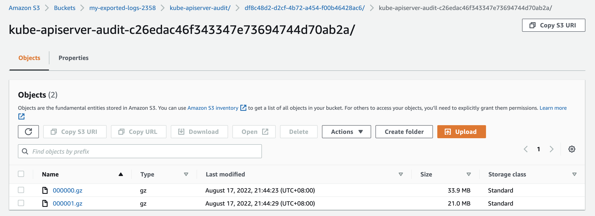

# Export Cloudwatch Log Group to S3
- https://docs.aws.amazon.com/zh_cn/AmazonCloudWatch/latest/logs/S3ExportTasks.html#S3Permissions
- 导出日志格式文件类似：


## create bucket and policy
```sh
bucket_name=my-exported-logs-2358-$RANDOM
aws_region=us-east-2
envsubst >policy.json <<-EOF
{
    "Version": "2012-10-17",
    "Statement": [
        {
            "Action": "s3:GetBucketAcl",
            "Effect": "Allow",
            "Resource": "arn:aws:s3:::${bucket_name}",
            "Principal": { "Service": "logs.${aws_region}.amazonaws.com" }
        },
        {
            "Action": "s3:PutObject" ,
            "Effect": "Allow",
            "Resource": "arn:aws:s3:::${bucket_name}/*",
            "Condition": { "StringEquals": { "s3:x-amz-acl": "bucket-owner-full-control" } },
            "Principal": { "Service": "logs.${aws_region}.amazonaws.com" }
        }
    ]
}
EOF

aws s3api create-bucket --bucket ${bucket_name} \
--create-bucket-configuration LocationConstraint=${aws_region} \
--region ${aws_region}

# will overwrite existed policy attached on s3 bucket !
aws s3api put-bucket-policy --bucket ${bucket_name} --policy file://policy.json

```

## export task
```sh
loggroup_name="/aws/eks/ekscluster1/cluster"
begin_time=$(date --date "2 days ago" +%s)
end_time=$(date --date "1 days ago" +%s)

suffix=$(date +%Y%m%d-%H%M%S)
#for i in kube-apiserver-audit kube-apiserver kube-scheduler authenticator kube-controller-manager cloud-controller-manager ; do
for i in kube-apiserver-audit ; do
  task_name=${i}-${suffix}
  # create export task
  aws logs create-export-task --task-name ${task_name} \
    --log-group-name ${loggroup_name} \
    --log-stream-name-prefix ${i} \
    --from ${begin_time}000 --to ${end_time}000 \
    --destination ${bucket_name} \
    --destination-prefix ${i} |tee /tmp/$$
  task_id=$(cat /tmp/$$ |jq -r '.taskId')
  while true; do
    # describe task
    aws logs describe-export-tasks \
      --task-id ${task_id} |tee /tmp/$$.task
    task_status=$(cat /tmp/$$.task |jq -r '.exportTasks[0].status.code')
    if [[ ${task_status} == "COMPLETED" ]]; then
      break
    fi
    sleep 10
  done
done

```

## remaining issues 
- 需要保存导出的时间点，以便于下次从改时间点继续
- 导出后将在指定的 prefix 中，创建 task id 为 folder ，按照所有 log stream name 作为下一层的 folder ，日志文件为 gz 压缩格式
- 可以省略 `log-stream-name-prefix` 参数，导出所有日志，考虑日志如何进行二次处理
- k8s控制日志包含类似前缀，比如 `kube-apiserver-audit-xxx` 和 `kube-apiserver-xxxx` ，并且前者是json格式日志，后者是行日志，如何进行区分导出到不同 prefix 路径，或者导出后如何进行二次处理，参考： [[stream-k8s-control-panel-logs-to-s3]] 
- 导出消息格式问题待解决 [[athena-sample-query#file-format-when-export-cwl-to-s3-]] 


