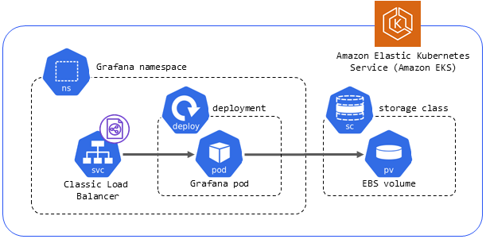

> [!WARNING] This is a github note

# Install Grafana on Beanstalk
## summary
Grafana 作为开源软件可以自由部署，1）在 ec2 中手动部署，除了 OS 和软件层面配置之外，不可避免需要一些额外的配置工作，包括 vpc 、 elb 安全组等；2）当然也有些解决方案将 Grafana 部署在 eks 集群上以解决高可用性问题，但如果只是希望简单使用可能会有点杀鸡用牛刀的感觉；3）本文描述了用 aws elastic beanstalk 提供一站式快速部署 Grafana，并且使用 efs 实现 grafana内部配置的持久化

## grafana container on beanstalk
- need efs for storage persistent
```sh
CLUSTER_NAME=efs0225
AWS_REGION=us-east-2
```

![[../../../CLI/awscli/efs-cmd#^d4lka9]]

refer: [[git/git-mkdocs/CLI/awscli/efs-cmd#create-efs-]]

mount nfs to instance ([link](https://aws.amazon.com/premiumsupport/knowledge-center/elastic-beanstalk-mount-efs-volumes/))

```sh
echo ${FILESYSTEM_ID}
```

- install beanstalk ([link](https://docs.aws.amazon.com/elasticbeanstalk/latest/dg/eb-cli3-install.html))
```sh
git clone https://github.com/aws/aws-elastic-beanstalk-cli-setup.git
python ./aws-elastic-beanstalk-cli-setup/scripts/ebcli_installer.py
# export env variable as instructions
```

- deploy with prebuild image
```sh
mkdir example-prebuild
cd example-prebuild
cat >docker-compose.yml <<-EOF
version: "3.8"

services:
  grafana:
    image: grafana/grafana-oss
    volumes:
      - "/efsmnt/grafana/var-lib-grafana:/var/lib/grafana"
      - "/efsmnt/grafana/var-log-grafana:/var/log/grafana"
    ports:
      - "80:3000"
    restart: always
EOF

mkdir .ebextensions

```
if you just use one pod, reference appendix

- customize config `.ebextensions/efs-mount.config`
```sh
wget -O /tmp/efs-mount.config 'https://github.com/awsdocs/elastic-beanstalk-samples/raw/main/configuration-files/aws-provided/instance-configuration/storage-efs-mountfilesystem.config'
# regexp different between egrep & sed
# using '\s*' to instead will be better
cat /tmp/efs-mount.config |egrep '^\s+FILE_SYSTEM_ID: '
sed -i '/^\s\+FILE_SYSTEM_ID: /s/:.*$/: '"${FILESYSTEM_ID}"'/' /tmp/efs-mount.config
cp /tmp/efs-mount.config .ebextensions/

```
another sample ([link](https://github.com/aws-samples/eb-php-wordpress))

- prep elastic beanstalk
```sh
APP_NAME=myapp$(date +%m%d)
ENV_NAME=${APP_NAME}-env$(date +%H%M)
eb init -p docker ${APP_NAME} --region ${AWS_REGION}
eb local run --port 3000
eb create ${ENV_NAME}

## after modify config
## create a new app version
eb appversion -c

## deploy using new appver
eb create --version app-230224_123456789012 app2-env-3

## swap ?
eb swap

```

- others parameters
```
cfg:default.paths.data=/var/lib/grafana cfg:default.paths.logs=/var/log/grafana cfg:default.paths.plugins=/var/lib/grafana/plugins cfg:default.paths.provisioning=/etc/grafana/provisioning
```


## grafana in ec2
- install 
```sh
cat <<-EOF |sudo tee /etc/yum.repos.d/grafana.repo
[grafana]
name=grafana
baseurl=https://rpm.grafana.com
repo_gpgcheck=1
enabled=1
gpgcheck=1
gpgkey=https://rpm.grafana.com/gpg.key
sslverify=1
sslcacert=/etc/pki/tls/certs/ca-bundle.crt
exclude=*beta*
EOF
sudo yum install -y grafana
sudo systemctl status grafana-server

```

- prep elb
    - alb + http3000 port 


## grafana on eks
- https://aws-quickstart.github.io/quickstart-eks-grafana/



### helm
```sh
helm repo add grafana https://grafana.github.io/helm-charts
```

## appendix - single pod in beanstalk
```sh
cat >Dockerrun.aws.json <<-EOF
{
  "AWSEBDockerrunVersion": "1",
  "Image": {
    "Name": "grafana/grafana-oss"
  },
  "Ports": [
    {
      "ContainerPort": 3000,
      "HostPort": 3000
    }
  ],
  "Logging": "/usr/local/glassfish5/glassfish/domains/domain1/logs"
}
EOF
```


