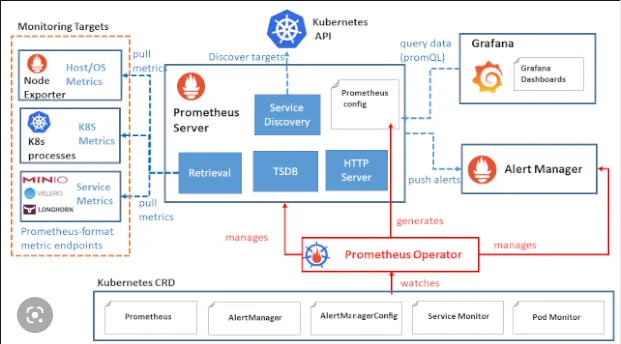

# install-prometheus-operator
## prep
- [[../../addons/ebs-for-eks#using-eksdemo-]] 

## (Prefer) install-prometheus-operator

- https://blog.devgenius.io/step-by-step-guide-to-setting-up-prometheus-operator-in-your-kubernetes-cluster-7167a8228877



```sh
DEPLOY_NAME=prom-0710
helm repo add prometheus-community https://prometheus-community.github.io/helm-charts
helm repo update

NAMESPACE_NAME=prom
helm install ${DEPLOY_NAME} prometheus-community/kube-prometheus-stack --namespace ${NAMESPACE_NAME} --create-namespace

# refer defualt value
# helm show values prometheus-community/kube-prometheus-stack > values_default.yaml
```

### forward to local
- port forward to cloud9
```sh
k get svc/${DEPLOY_NAME}-grafana
k port-forward svc/${DEPLOY_NAME}-grafana 3000:80 --address='0.0.0.0'

```

- access from your laptop
```sh
# you need AKSK environment variables
INST_ID=<cloud9_inst_id>
aws ssm start-session --target ${INST_ID} --document-name AWS-StartPortForwardingSession --parameters '{"localPortNumber":["3000"],"portNumber":["3000"]}'

###
# access local 3000 with 
# admin / prom-operator
###

```

### install prom operator, accept remote write
- enable remote write receiver: `enableRemoteWriteReceiver=true`
```yaml title="prom.yaml"
grafana:
  enabled: true
  service:
    type: LoadBalancer
    annotations:
      service.beta.kubernetes.io/aws-load-balancer-type: "external"
      service.beta.kubernetes.io/aws-load-balancer-scheme: internet-facing
  grafana.ini: 
    auth:
      sigv4_auth_enabled: true 
prometheus:
  enabled: true
  service:
    type: LoadBalancer
    annotations:
      service.beta.kubernetes.io/aws-load-balancer-type: "external"
      service.beta.kubernetes.io/aws-load-balancer-scheme: internet-facing
  prometheusSpec:
    enableRemoteWriteReceiver: true
    externalLabels: 
      cluster: "ekscluster1"
      cluster_name: "ekscluster1"
      origin_prometheus: "ekscluster1"
```

```sh
helm install -f prom.yaml ${DEPLOY_NAME} prometheus-community/kube-prometheus-stack --namespace monitoring --create-namespace
```

### install prometheus only, without grafana
```sh
CLUSTER_NAME=ekscluster4
DEPLOY_NAME=prom-operator-${CLUSTER_NAME}
NAMESPACE_NAME=monitoring

# enable grafana and typical prometheus
envsubst >values-${CLUSTER_NAME}-1.yaml <<-EOF
grafana:
  enabled: false
prometheus:
  prometheusSpec:
    additionalArgs: 
    - name: storage.tsdb.min-block-duration
      value: 5m
    - name: storage.tsdb.max-block-duration
      value: 5m
    replicas: 2
    retention: 730h # one month
    retentionSize: "100GB"
    ruleSelectorNilUsesHelmValues: false
    serviceMonitorSelectorNilUsesHelmValues: false
    podMonitorSelectorNilUsesHelmValues: false
    topologySpreadConstraints: 
    - maxSkew: 1
      topologyKey: topology.kubernetes.io/zone
      whenUnsatisfiable: DoNotSchedule
      labelSelector:
        matchLabels:
          app: prometheus
    # additionalScrapeConfigsSecret: 
    #   enabled: true
    #   name: additional-scrape-configs
    #   key: avalanche-additional.yaml
    storageSpec: 
      volumeClaimTemplate:
        spec:
          storageClassName: ${STORAGECLASS_NAME}
          accessModes: ["ReadWriteOnce"]
          resources:
            requests:
              storage: 200Gi
        selector: {}
    remoteWrite: 
    - url: http://k8s-thanos-thanosre-xxx.elb.us-west-2.amazonaws.com:19291/api/v1/receive
    externalLabels: 
      cluster: "${CLUSTER_NAME}"
      cluster_name: "${CLUSTER_NAME}"
      origin_prometheus: "${CLUSTER_NAME}"
EOF

helm upgrade -i -f values-${CLUSTER_NAME}-1.yaml ${DEPLOY_NAME} prometheus-community/kube-prometheus-stack --namespace ${NAMESPACE_NAME} --create-namespace

```


- https://github.com/prometheus-operator/prometheus-operator/issues/2918
External labels are only attached when data is communicated to the outside so you will see them in:
- Outgoing alerts (although we do automatically drop the "prometheus_replica" label, so alerts are unique and can be deduplicated by Alertmanager)
- Remote-read endpoint
- Remote-write
- /federate endpoint


### install with thanos
- refer: [[TC-prometheus-ha-architect-with-thanos]]

![[attachments/install-prometheus-operator/IMG-install-prometheus-operator-1.png]]

## (DO NOT USE) install prometheus from github
https://github.com/prometheus-operator/kube-prometheus
```
kubectl apply --server-side -f manifests/setup
kubectl wait \
	--for condition=Established \
	--all CustomResourceDefinition \
	--namespace=monitoring
kubectl apply -f manifests/
```
- it uses <mark style="background: #FF5582A6;">prometheus-adapter</mark> as metrics.k8s.io APIService instead of metrics-server.
- maybe it has some performance metrics <mark style="background: #FF5582A6;">accuracy issue</mark>, when you have limit/request settings in POD and resources breach.

## (Optional) install prometheus and grafana

- install prometheus
```sh
kubectl create namespace prometheus

helm repo add prometheus-community https://prometheus-community.github.io/helm-charts

helm install prometheus prometheus-community/prometheus \
    --namespace prometheus \
    --set alertmanager.persistentVolume.storageClass="gp2" \
    --set server.persistentVolume.storageClass="gp2"

kubectl get all -n prometheus

```

- install grafana
```sh
cat > ./grafana.yaml <<-EOF
datasources:
  datasources.yaml:
    apiVersion: 1
    datasources:
    - name: Prometheus
      type: prometheus
      url: http://prometheus-server.prometheus.svc.cluster.local
      access: proxy
      isDefault: true
EOF

helm repo add grafana https://grafana.github.io/helm-charts
kubectl create namespace grafana
helm install grafana grafana/grafana \
    --namespace grafana \
    --set persistence.storageClassName="gp2" \
    --set persistence.enabled=true \
    --set adminPassword='EKS!sAWSome' \
    --values ./grafana.yaml \
    --set service.type=LoadBalancer
kubectl get all -n grafana

```

- dashboard
	- cluster monitoring dashboard: **3119**
	- pod monitoring dashboard: **6417**
	- some other dashboard in [[../../../../../../grafana|grafana]]


## refer
- https://archive.eksworkshop.com/intermediate/240_monitoring/prereqs/
- External labels are only attached when data is communicated to the outside, including Outgoing alerts, remote write, remote read endpoint, `/federate` endpoint, etc.
    - https://github.com/prometheus-operator/prometheus-operator/issues/2918


