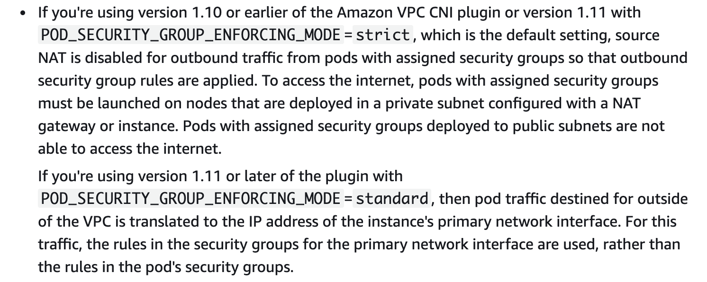
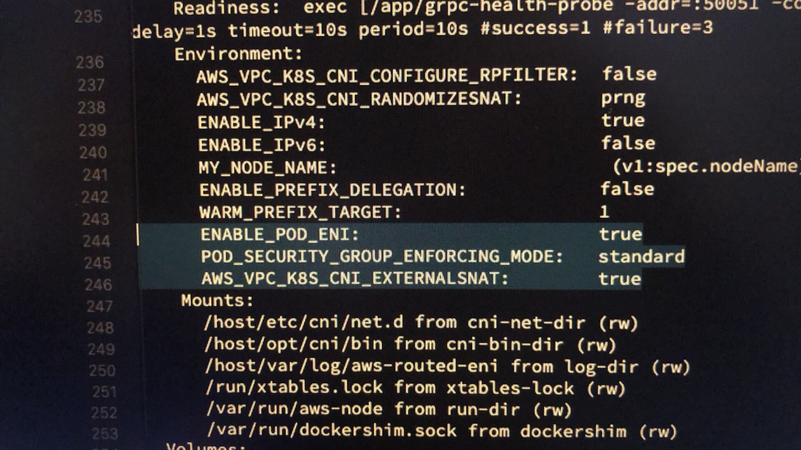

# enable-sg-on-pod

## useful-env-sg-on-pod

*considerations*
https://docs.amazonaws.cn/en_us/eks/latest/userguide/security-groups-for-pods.html



[[upgrade-vpc-cni]]



第一个参数允许pod 挂sg
第二个参数允许有sg的pod同时遵守network policy控制
第三个参数snat disable，允许跨vpc保留pod ip，不会转成primary eni ip ([[../../addons/eks-external-snat]])

```sh
kubectl -n kube-system set env daemonset aws-node ENABLE_POD_ENI=true
kubectl -n kube-system set env daemonset aws-node POD_SECURITY_GROUP_ENFORCING_MODE=standard
kubectl -n kube-system set env daemonset aws-node AWS_VPC_K8S_CNI_EXTERNALSNAT=true
kubectl -n kube-system rollout status ds aws-node

```

more explanation for ENV on vpc cni github
- https://github.com/aws/amazon-vpc-cni-k8s/blob/master/README.md#:~:text=recycle%20the%20instance.-,POD_SECURITY_GROUP_ENFORCING_MODE,-(v1.11.0%2B)


## workshop
https://www.eksworkshop.com/beginner/115_sg-per-pod/

- create SG
```sh
CLUSTER_NAME=ekscluster1

export VPC_ID=$(aws eks describe-cluster \
  --name ${CLUSTER_NAME} \
  --query "cluster.resourcesVpcConfig.vpcId" \
  --output text)

# create the POD security group
aws ec2 create-security-group \
    --description 'POD SG' \
    --group-name 'POD_SG' \
    --vpc-id ${VPC_ID}

# save the security group ID for future use
export POD_SG=$(aws ec2 describe-security-groups \
    --filters Name=group-name,Values=POD_SG Name=vpc-id,Values=${VPC_ID} \
    --query "SecurityGroups[0].GroupId" --output text)

echo "POD security group ID: ${POD_SG}"

```

- for **managed** node group, allow DNS ingress
```sh
NODE_GROUP_SG=$(aws ec2 describe-security-groups \
  --filters Name=tag:Name,Values=eks-cluster-sg-${CLUSTER_NAME}-* Name=vpc-id,Values=${VPC_ID} \
  --query "SecurityGroups[0].GroupId" \
  --output text)
echo "Node Group security group ID: ${NODE_GROUP_SG}"

# allow POD_SG to connect to NODE_GROUP_SG using TCP 53
aws ec2 authorize-security-group-ingress \
    --group-id ${NODE_GROUP_SG} \
    --protocol tcp \
    --port 53 \
    --source-group ${POD_SG}

# allow POD_SG to connect to NODE_GROUP_SG using UDP 53
aws ec2 authorize-security-group-ingress \
    --group-id ${NODE_GROUP_SG} \
    --protocol udp \
    --port 53 \
    --source-group ${POD_SG}

```

- for unmanaged node group created by `eksctl`, allow DNS ingress
```sh
# eksctl-ekscluster1-nodegroup-ng1-SG-1XX82XXXXXX5Y)
UNMANAGED_NODE_GROUP_SG=$(aws ec2 describe-security-groups \
  --filters Name=tag:Name,Values=eksctl-${CLUSTER_NAME}-nodegroup-* Name=vpc-id,Values=${VPC_ID} \
  --query "SecurityGroups[0].GroupId" \
  --output text)
echo "UNMANAGED Node Group security group ID: ${UNMANAGED_NODE_GROUP_SG}"

# allow POD_SG to connect to NODE_GROUP_SG using TCP 53
aws ec2 authorize-security-group-ingress \
    --group-id ${UNMANAGED_NODE_GROUP_SG} \
    --protocol tcp \
    --port 53 \
    --source-group ${POD_SG}

# allow POD_SG to connect to NODE_GROUP_SG using UDP 53
aws ec2 authorize-security-group-ingress \
    --group-id ${UNMANAGED_NODE_GROUP_SG} \
    --protocol udp \
    --port 53 \
    --source-group ${POD_SG}

```

- CNI config
```sh
# ensure cluster role has AmazonEKSVPCResourceController policy
export CLUSTER_ROLE=$(aws eks describe-cluster \
  --name ${CLUSTER_NAME} \
  --query "cluster.roleArn" \
  --output text)

aws iam list-attached-role-policies --role-name ${CLUSTER_ROLE##*/}

```

```sh
kubectl -n kube-system set env daemonset aws-node ENABLE_POD_ENI=true
kubectl -n kube-system set env daemonset aws-node AWS_VPC_K8S_CNI_EXTERNALSNAT=true
kubectl -n kube-system set env daemonset aws-node POD_SECURITY_GROUP_ENFORCING_MODE=standard
kubectl -n kube-system rollout status ds aws-node

kubectl get nodes --show-labels
# will see `vpc.amazonaws.com/has-trunk-attached=true`

```

- create resources (if you create resource on fargate, see below)
```sh
# check CRDs existed
kubectl get crd securitygrouppolicies.vpcresources.k8s.aws

envsubst > ./sg-policy.yaml <<-EoF
apiVersion: vpcresources.k8s.aws/v1beta1
kind: SecurityGroupPolicy
metadata:
  name: allow-rds-access
spec:
  podSelector:
    matchLabels:
      app: echoserver
  securityGroups:
    groupIds:
      - ${POD_SG}
EoF

k create ns echo1
k apply -f sg-policy.yaml -n echo1
k apply -f deployment-service.yaml -n echo1
k apply -f ingress1.yaml -n echo1

k create ns echo2
k apply -f sg-policy.yaml -n echo2
k apply -f deployment-service.yaml -n echo2
k apply -f ingress2.yaml -n echo2

k create ns echo3
k apply -f deployment-service.yaml -n echo3
k apply -f ingress3.yaml -n echo3

```

- echoserver deployment & service
```sh
cat > ./deployment-service.yaml <<-EoF
---
apiVersion: apps/v1
kind: Deployment
metadata:
  name: echoserver
spec:
  selector:
    matchLabels:
      app: echoserver
  replicas: 1
  template:
    metadata:
      labels:
        app: echoserver
    spec:
      containers:
      - image: k8s.gcr.io/e2e-test-images/echoserver:2.5
        imagePullPolicy: Always
        name: echoserver
        ports:
        - containerPort: 8080
---
apiVersion: v1
kind: Service
metadata:
  name: echoserver
spec:
  ports:
    - port: 80
      targetPort: 8080
      protocol: TCP
  type: NodePort
  selector:
    app: echoserver
EoF

```

- echoserver ingress for echo1
- echoserver ingress for echo2
- echoserver ingress for echo3
refer [[awslbc-ingress-settings-ingress-group]]

- resource yaml for pod on **fargate**
```sh
envsubst > ./sg-policy.yaml <<-EoF
apiVersion: vpcresources.k8s.aws/v1beta1
kind: SecurityGroupPolicy
metadata:
  name: allow-rds-access
spec:
  podSelector:
    matchLabels:
      app: echoserver
  securityGroups:
    groupIds:
      - ${POD_SG}
      - ${NODE_GROUP_SG} # cluster SG
EoF

```

## refer
- [[../../addons/eks-external-snat|eks-external-snat]]


