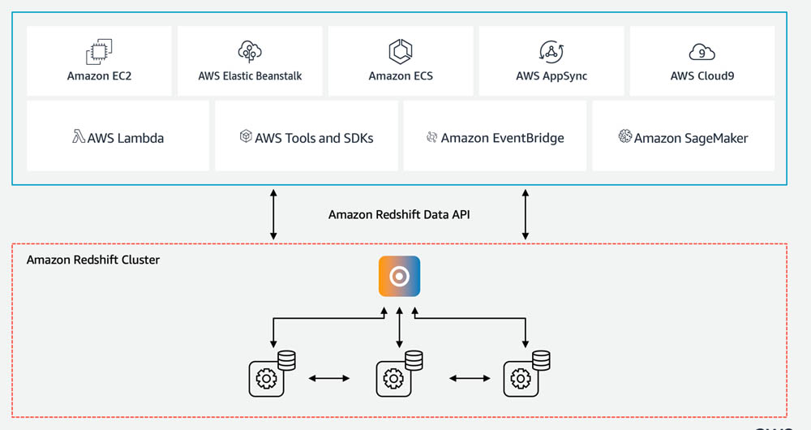

# redshift-data-api-lab

## 使用场景
Amazon Redshift 数据 API 使您能够使用所有类型的传统、云原生和容器化、基于 Web 服务的无服务器应用程序和事件驱动的应用程序轻松访问来自 Amazon Redshift 的数据。



Amazon Redshift Data API 不能替代 JDBC 和 ODBC 驱动程序，适用于不需要与集群建立持久连接的用例。它适用于以下用例：

- 使用 AWS 开发工具包支持的任何编程语言从自定义应用程序访问 Amazon Redshift。这使您能够集成基于 Web 服务的应用程序，以使用 API 访问来自 Amazon Redshift 的数据以运行 SQL 语句。例如，您可以从 JavaScript 运行 SQL。
- 构建无服务器数据处理工作流程。
- 设计异步 Web 仪表板，因为 Data API 允许您运行长时间运行的查询，而无需等待它完成。
- 运行一次查询并多次检索结果，而无需在 24 小时内再次运行查询。
- 使用 AWS Step Functions、Lambda 和存储过程构建您的 ETL 管道。
- 简化了从 Amazon SageMaker 和 Jupyter 笔记本对 Amazon Redshift 的访问。
- 使用 Amazon EventBridge 和 Lambda 构建事件驱动的应用程序。
- 调度 SQL 脚本以简化物化视图的数据加载、卸载和刷新。

## 初始化-redshift-集群-
- 创建 redshift 集群 ([link](https://catalog.us-east-1.prod.workshops.aws/workshops/9f29cdba-66c0-445e-8cbb-28a092cb5ba7/en-US/lab1#cloud-formation)), or open this [cloudformation template](../git-attachment/redshift-immersion.yaml) directly
    - 创建 vpc 加 2 个公有子网，并且创建 public access 的 redshift 集群
    - InboundTraffic --> `0.0.0.0/0`
    - EETeamRoleArn --> `arn:aws:iam::xxxxxxxxxxxx:role/TeamRole`
    - MasterUserPassword --> default
    - DataLoadingPrimaryCluster --> Yes 
        - check cloudwatch for more detail
        - data loading need more 10 mins after cloudformation completed
- (option) 然后从这里加载数据 ([link](https://catalog.us-east-1.prod.workshops.aws/workshops/9f29cdba-66c0-445e-8cbb-28a092cb5ba7/en-US/lab2))

## rest-api lab
- [postman example](https://github.com/aws-samples/getting-started-with-amazon-redshift-data-api/tree/main/use-cases/rest-api-with-redshift-data-api)

### list database


post url: `https://redshift-data.us-east-2.amazonaws.com/`

head:
`x-amz-target`: `RedshiftData.ListDatabases`
`Content-Type`: `application/x-amz-json-1.1`

body:
```json
{
    "ClusterIdentifier": "redshift-cluster-1",
    "Database": "dev",
    "DbUser": "awsuser"
}
```
 
### list tables
head:
`x-amz-target`: `RedshiftData.ListTables`

### execute statement
head:
`x-amz-target`: `RedshiftData.ExecuteStatement`

body:
```json
{
    "ClusterIdentifier": "redshift-cluster-1",
    "Database": "dev",
    "DbUser": "awsuser",
    "Sql": "SELECT * FROM \"dev\".\"public\".\"event\";"
}
```


## command line lab
- [shell/python example](https://github.com/aws-samples/getting-started-with-amazon-redshift-data-api/tree/main/use-cases/ec2-redshift-access)

```sh
aws redshift-data list-tables  --database dev \
    --db-user admin \
    --cluster-identifier redshift-cluster-us \
    --region us-east-1  \
    --table-pattern "prod%" \
    --schema-pattern "rs%"
```

```json
{
    "Tables": [
        {
            "name": "event",
            "schema": "public",
            "type": "TABLE"
        }
    ]
}
```


## reference
- [Get started with the Amazon Redshift Data API](https://aws.amazon.com/blogs/big-data/get-started-with-the-amazon-redshift-data-api/)
- [Using the Amazon Redshift Data API to interact with Amazon Redshift clusters](https://aws.amazon.com/blogs/big-data/using-the-amazon-redshift-data-api-to-interact-with-amazon-redshift-clusters/)

### broken
- [Build a REST API to enable data consumption from Amazon Redshift](https://aws.amazon.com/blogs/big-data/build-a-rest-api-to-enable-data-consumption-from-amazon-redshift/)

us-east-1 only

post data:
```
{
    "createdate": "03/01/2022",
    "productname": "Flower",
    "sku": "FLOWER123",
    "requesttype": "Product"
}
```


